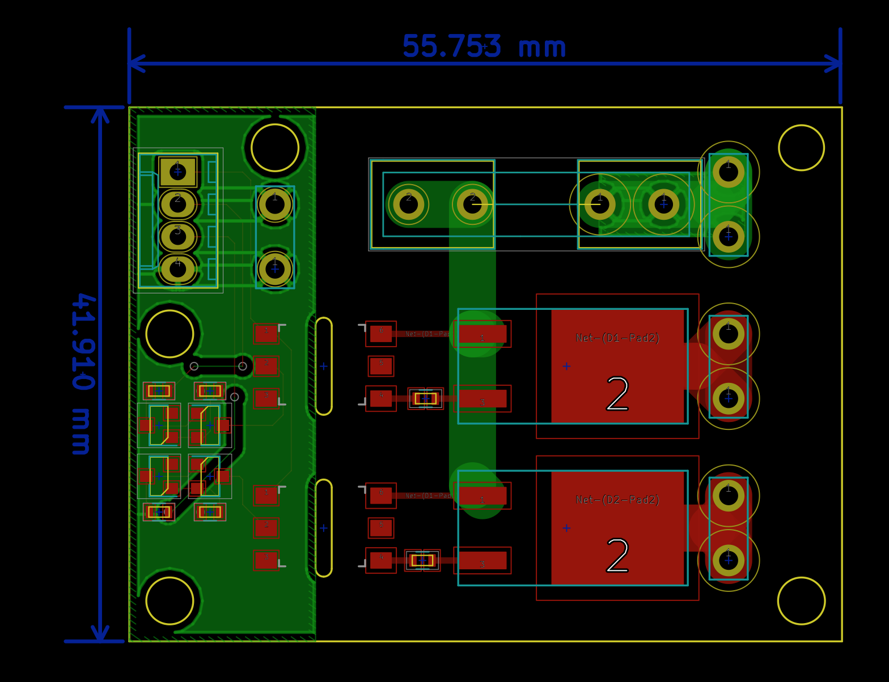

# A double solid state relay for North America duplex mains switching

I wanted to have an extension cord, with power distribution (many outlets), so like a power bar. On my desk. That I could conveniently switch on in an arbitrary way.

# WARNING

Disclimer. Danger. Working with mains AC power is dangerous. You can die. Your kids can die. Your pets can die. You can burn down your house. You can cause your neighbor's house to burn down when your house is burning down.

You have to know how to be safe. Never connect live AC mains to something without having all the conductors insulated. Always test AC switching things using a low voltage AC source, such as a transformer, before trying to plug your stuff in for the first time.  There are a lot of good articles and discussion on the Internet. Read up. Know what you need to do to be safe

Doing anything I do here is something you are doing at your own risk. I am actively telling you to not do anything I am doing here.

# Background
For many years I have always assembled my own power distribution devices.

This goes back to 1990's era of computing where most peripheral devices had their own Class 2 plug in wall transformer (AKA brick) and the bulk of these things would cover several slots on the typical K-Mart power bar strips. So then you need to buy three power strips and chain them all together. And this is worse, both electrically and aesthetically.

Now I guess there are less peripherals that need big dumb bulky bricks. But I sort of appreciate the extra features I can achieve by having a customizable power strip. Like this most recent one I use on my workbench.

Some plugs have the half a plug, half a switch. So I can conveniently switch the thing off instead of having to (un)plug it every time. This is also useful for stopping phantom power loss, like the computer power brick when I am not at home.

The downside is lately I have more small desk appliances I want to have plugged in. Lamps. Solder stations. I would have enough plugs if it was not for half of my plugs being taken up by switches. And of course when your desk is a littered mess of several in progress project ideas you will never get around to finishing, it is somewhat inconvenient to have to reach over all this mess and find the right switch.  Of course it would be neat to have some other means to just control these plugs.  Like a system tray widget on my computer, a simple USB to GPIO device to control the switching of the plugs.

Of course it is awesome to build something that is "internet of things". Make a fun app to control a plug from anywhere in the world!.  Apps!! I could build a small wifi or bluetooth receiver into the plug box and have an elegant wireless control too.

Well, this is not quite there yet. I thought I would start with building just the switching part of things. Which technically is just a solid state relay. And to use regular wires to control it. Then then I can work on building integrations or wireless signalling, or apps, or even just a panel with legacy push buttons.

# Theory

I really did not consider using mechanical relays because of their bulky size. I wanted something that could fit into a regular metal plug box.  There are a lot of relay modules, shields, IO boards. Some have nice opto isolators even. These all feel somewhat poor quality. Or on their own, incomplete. Such as the circuit board does not have holes for mounting it. Or there is no fuze. Or you need to give them 12V. Or you need to drive an active low signal to control the relay. They just didn't feel like a good fit for what I wanted.

Really it is more elegant to use Triac device with an opto isolator. This is the same feature and behavior as a solid state relay. Ok. fine. Just get a couple nice solid state relays. Done. Nothing to see or do here.
Well. its just that a regular solid state relay is quite expensive. They usually come in a very rugged and somewhat bulky panel mount kind of package. I am not using hex bolts to torque these onto an elevator control panel here. I just want to make my desk lamp turn on. Also. I am poor and can not afford to buy these.

I took a few minutes to read up on what kinds of Triacs are out there, and found I like these [STMicroelectronics Snubberless series Triacs](http://www.st.com/content/ccc/resource/technical/document/application_note/ca/ef/9d/1e/4a/9f/47/69/CD00003865.pdf/files/CD00003865.pdf/jcr:content/translations/en.CD00003865.pdf).
On their own they offer us a lot of features.  And this application note demonstrates how they could be used to create a solid state relay, by fronting them ith an opto isolator with zero crossing detection and triac output.

So then,

We have a connector there for AC ground to be also our ground.

This is actually two swiches. The idea being that in a standard duplex plug there are two halves (top and bottom). So that we can provide individual switching to each half. Which will allow us to plug two lights into a single duplex plug.

The board can be laid out small enough to fit inside a metal duplex outlet style box. So that we can provide control wires into the box.
I was invisioning an extension cord with the metal plug box on the end with this controller board inside the metal box.

This keeps all of the 120V AC inside the extension cord and outlet box. We do not need to have 120V wires going out of the box to our circuit board. Which is a good thing here, since we are working with both water and electricity.

So to use this we will just need 2 digital IO pins from the Pi.

# Assembly
This is definitely one of those things where it requires more effort and consideration to take a project idea from a schematic or concept to a finished product.

In this case, It was challenging for me to breadboard this, because the pieces are all surface mount. And I have reservations about using 120V AC on a solderless breadboard. I would never do this.

Instead I had some circuit boards built using OSHPark and then assembled some the pieces.

This first version I managed to mix up the A1 and A2 pin outs for the triac

I believe the issue was I chose the standard footprint for "a triac" with the pin out A,A,G. But maybe this D2PAK type package has a different pin numbering than the TO-220 type case?   So I updated the schematic and board layout for next time.

It turns out this is super important. We basically require a voltage across the A2 and G. not the A1 and G as I have it (the images in this document are still wrong. The kicad project is updated).

So fixing the circuit board with some bodge resistors and cutting the trace they work now. Remember. this is a prototype.  I also tested this using a 120V to 12VAC transformer, and test lit up an old automotive headlamp I had in a junk bin. Before graduating to try to test switch AC mains things.

Note there is a cut out under those opto isolators, so as to improve the isolation between the low voltage and high voltage side. I also have the metal box ground connecting to the ground plane on the low voltage side. There is no ground plan on the AC side.  Just the wide traces and the pad for the triacs which goes directly to these terminal connectors.

With the board ready to go and, its time to assemble into the metal plug box.

The plug itself has that metal bridge bar between the top and bottom outlets cut. So that they may be powered individuall.

I use the nice crimp and spade connectors, as according to electrical code, we can't be soldering these wires, the risk of mechanical separation and high resistance of the solder joint causing a fire. I didn't have to, but also used fork terminals on the wires for the screw to the plug. Just makes for a nicer wiring job, and now there are no possibility of stray wires coming out from under the screw terminals.

According to electrical code, low voltage wires can not exist within the same box, conduict, or package as high voltage wires. With the exception if you are making an all in one powered plug in wireless access point.

The only wires inside this box are the 14 gauge AC wires.

The low voltage side of things was designed to be on the neutral side of the plug. The hot side of the plug being on the side where the wire and terminal connectors are.

The board is mounted inside the metal plug box by drilling some holes into the metal box. And using 1/4 inch hex aluminum stand offs.

Here I do not have a physical baffle between the low voltage and high voltage side. Though the precautions I took above are likely ok for my use for now.

The only thing I do not like about this is the need to have an actual wire wired up to the box. I would prefer to have some kind of connector. I was thinking RJ-11 because this control cable is old flat phone wire I had on hand.

# Next steps

* I would like some feedback for how this is constructed. Is there anything I can do better?

* I would like to get my circuit board CSA approved, or UL certified. So then it could be used in like my office without causing anyone undue concern.

* Design a 3.3v power supply, or use an existing module thta does this, so I can stuff small wireless or bluetooth micro controller into the plug. maybe a separate circuit board for this. Though I kind of like the idea of "just a plug control", it would be more practical in a general use to have these around a house and not just on my workbench.